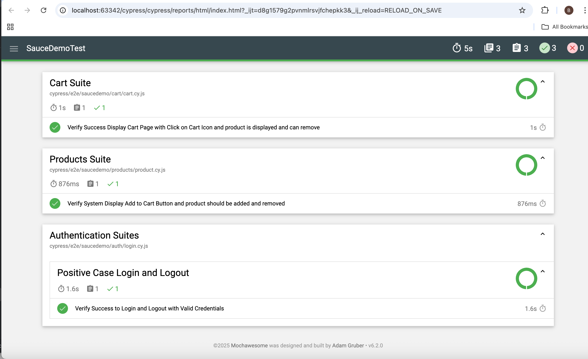

This repository is the result of a project practice aimed at learning and applying Web Automation testing using Cypress. The main focus of this project is to validate the core functionalities of Saucedemo. The web automation Saucedemo covering the functional test of auth, cart, and products. This source of project is Saucedemo web demo application

Test Cases

The test cases included in this project are:

    Test Login with Valid Credentials: Validates the login functionality using valid credentials.
    Test Login with Invalid Credentials: Validates the login functionality using invalid credentials.
    Test Add items to cart: Tests the ability to add items to cart.
    Test Remove items from cart: Tests the process of remove items from cart.
    Test Valid Checkout: Tests the checkout process and filling all required data.

Screenshot of Saucedemo Report
Mochawesome Report

Mochawesome Report
Terminal Report
Getting Started
Prerequisites

Ensure that you have the following software installed on your machine:

    Node.js (version 14 or higher)
    npm (Node package manager)

Installation
Clone this repository:

git clone https://github.com/BhawnaPatel/SauceDemoAssignment
cd repo

Install cypress

npm install cypress --save-dev

Install Mochawesome

npm install mochawesome mocha --save-dev

Running The Suites Test

npx cypress open